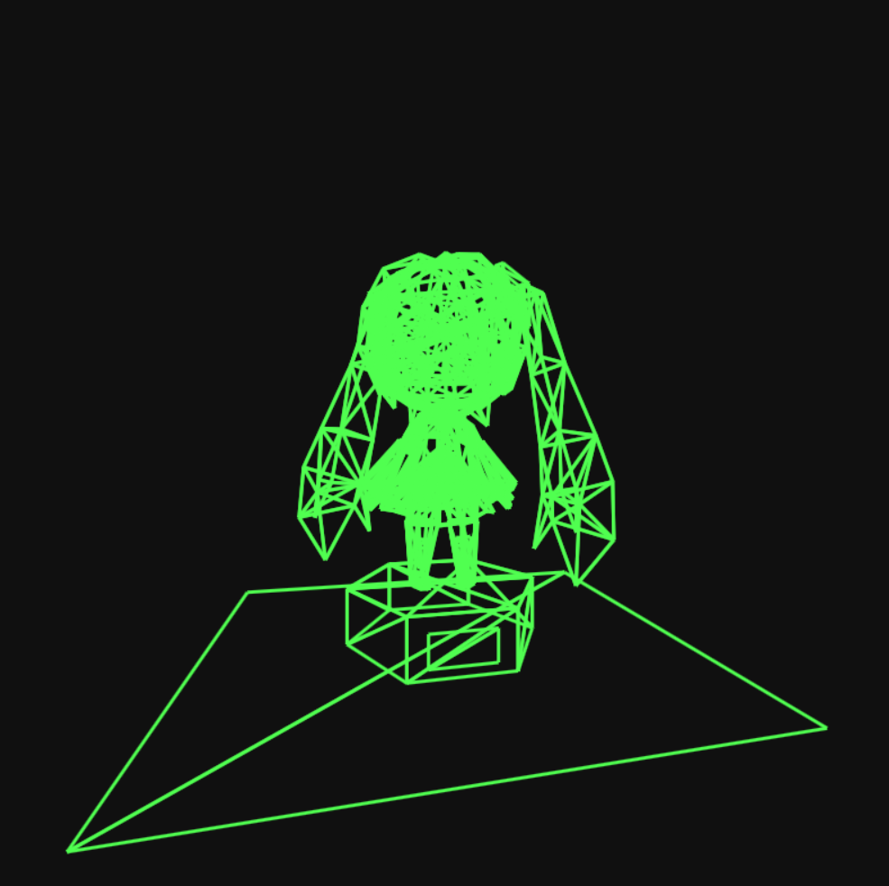

# One Formula That Demystifies 3D Graphics

This repo contains source code I wrote while learing from [tsoding's video](https://www.youtube.com/watch?v=qjWkNZ0SXfo), you can also check out his repo [here](https://github.com/tsoding/formula).

I used most of his code, and made some of my own changes here:

- `convert.js` for converting your obj file to a json file which can be directly read by javascript.

I also wrote a blog for this formula, which you can find [here](https://lightmon233.github.io/posts/2026/%E4%B8%80%E4%B8%AA%E6%8F%AD%E5%BC%803d%E5%9B%BE%E5%BD%A2%E7%A5%9E%E7%A7%98%E9%9D%A2%E7%BA%B1%E7%9A%84%E5%85%AC%E5%BC%8F/).

## Quick Start
1. Clone this repo:
```bash
git clone https://github.com/lightmon233/simple-formula-3D.git
```

2. Convert your obj file to json using nodejs:
```bash
node convert.js <my_model>.obj 
```
this will generate a json file with the same filename as your obj file.

Now this repo contains my self-generated json and obj file from:

["Hatsune Miku"](https://skfb.ly/oRF6t) by 雨宮レン which is licensed under [Creative Commons Attribution](http://creativecommons.org/licenses/by/4.0/).

3. Since your browser might have blocked local file input using `file://` protocol, you should start a web-server: 

either `npx serve .` or `python -m http.server 8000` is OK, depending your web-server environment.

## Preveiw


